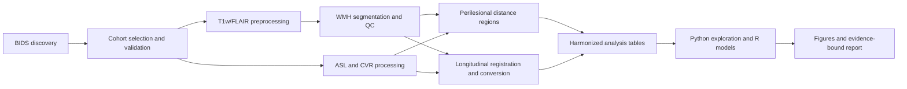
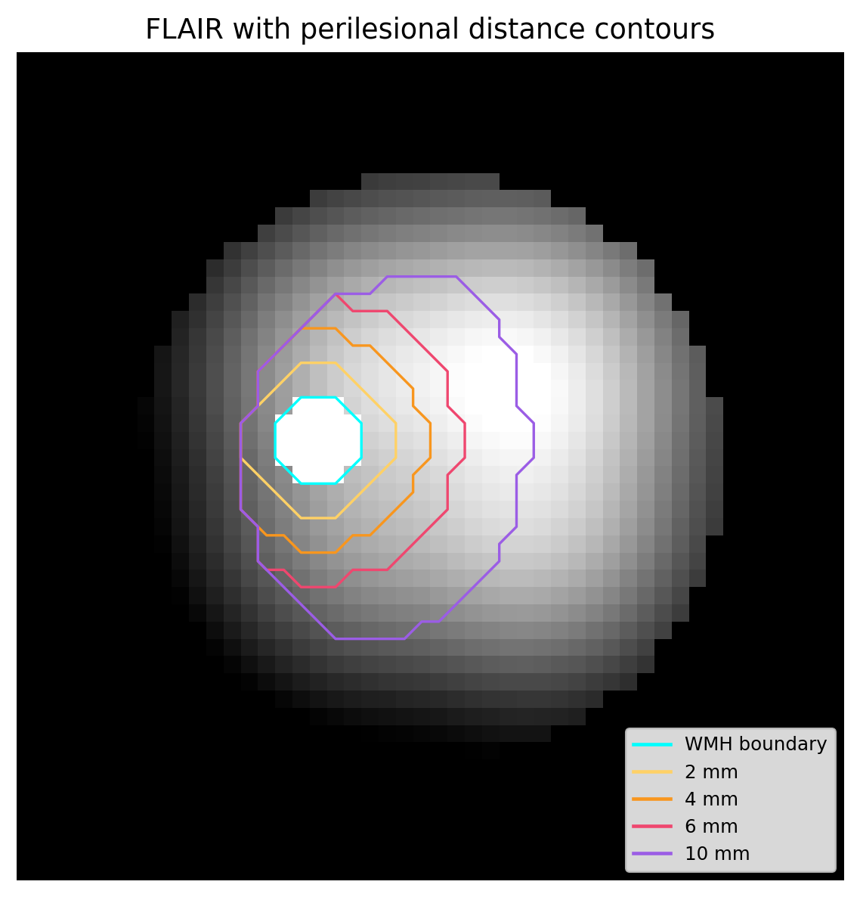
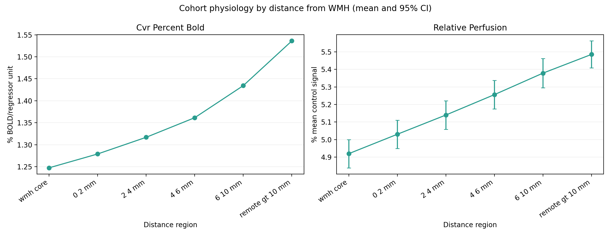
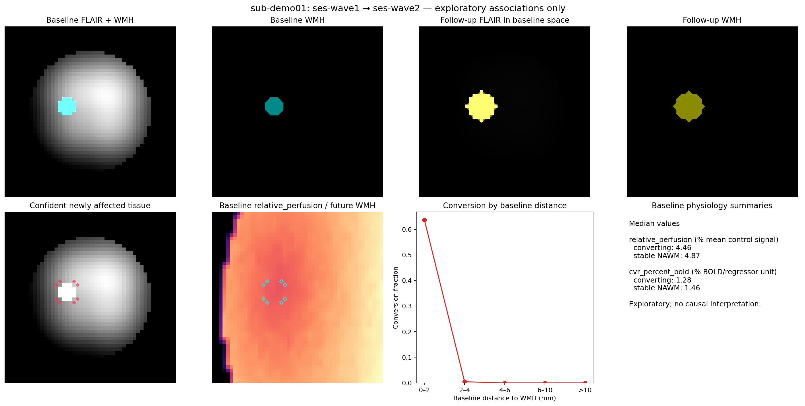
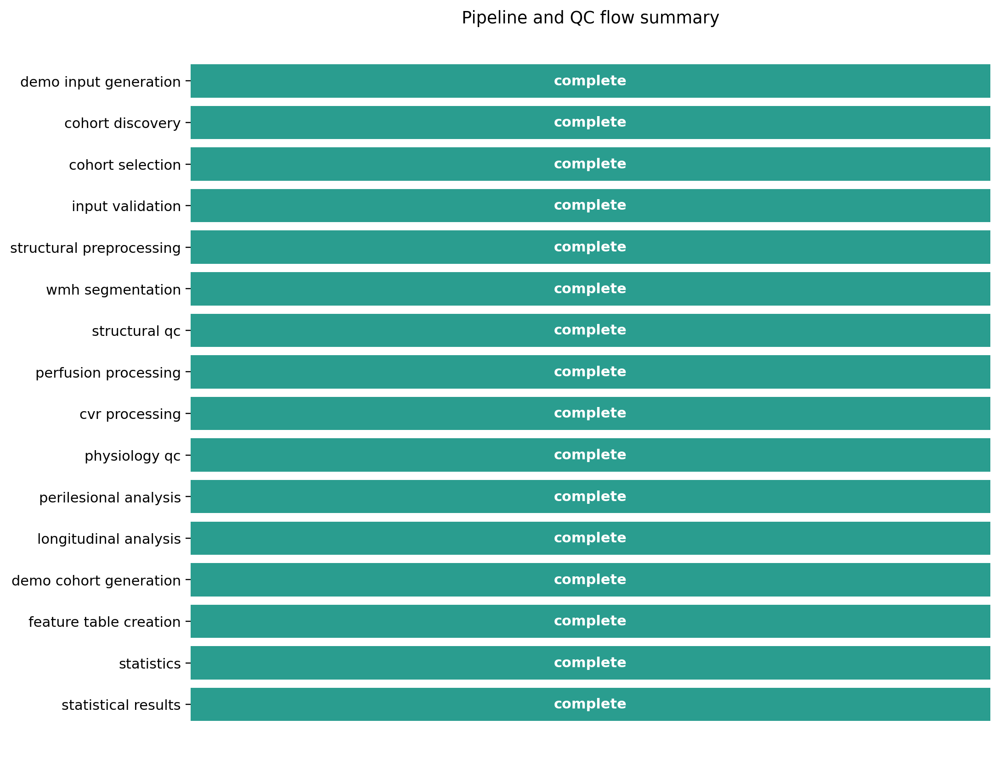

# Mapping the Vascular Edge: Longitudinal MRI of White Matter Lesion Expansion

This project investigates whether cerebrovascular abnormalities extend beyond visible white-matter hyperintensity (WMH) boundaries and whether baseline physiology differs in white matter that later develops lesions. It provides a CPU-first, configuration-driven pipeline for structural MRI, ASL perfusion, hypercapnia BOLD/CVR, perilesional distance analysis, longitudinal conversion, cognition, and cohort statistics.

> The figures below are **synthetic demonstrations, not empirical findings**. No participant imaging is distributed with this repository, and generated conclusions always follow the available estimates—including null or non-estimable results.

## Research question

Does perfusion or cerebrovascular response vary with physical distance from visible WMH, and is baseline physiology different in normal-appearing white matter that converts to WMH at follow-up?

## Why this matters

WMH masks show established injury, but a binary boundary may not capture surrounding tissue vulnerability. Measuring physiology in millimeter-scale neighborhoods and in tissue defined by future lesion status can test whether the apparent lesion edge is also a physiological edge, while preserving uncertainty and avoiding voxel-level pseudoreplication.

## Dataset

The workflow was designed around the publicly available Dallas Lifespan Brain Study (DLBS), OpenNeuro `ds004856`, but accepts local BIDS-like T1w/FLAIR, ASL, and documented hypercapnia BOLD inputs. Data discovery is modality-aware: absent ASL, CVR, longitudinal imaging, or cognition is reported as unavailable rather than imputed. Dataset files remain subject to their source terms and are never committed here.

## Pipeline diagram



Every stage writes provenance and a status (`complete`, `resumed`, `skipped`, or `failed`). Re-running the command reuses valid subject-level derivatives.

## Main analyses

- Perilesional repeated measurements across WMH core, 0–2, 2–4, 4–6, 6–10 mm, and remote normal-appearing white matter.
- Longitudinal WMH change and baseline physiology in converting versus stable tissue.
- Perfusion and CVR summaries with units and calibration limitations retained.
- Demographic and cognitive harmonization that preserves source variables; domain composites require explicit configured components and directions.
- Bootstrap confidence intervals and Benjamini–Hochberg control within related exploratory hypothesis families.
- R mixed models only when repeated-measure structure and sample size support estimation.

## Example outputs

Synthetic examples generated by `vascular-edge run --config configs/analysis.yaml --demo`:

| Perilesional anatomy | Cohort profile |
|---|---|
|  |  |
| Longitudinal expansion | Pipeline/QC flow |
|  |  |

The workflow also produces multimodal, segmentation-QC, perfusion-contour, and converting-versus-stable figures plus a Markdown research report.

## Installation

Python 3.10–3.12 is supported.

```bash
python -m venv .venv
# Windows: .venv\Scripts\activate
# macOS/Linux: source .venv/bin/activate
python -m pip install --upgrade pip
pip install -e ".[dev]"
```

For the exact environment tested for this release, use `pip install -r environment/requirements-lock.txt` followed by `pip install -e . --no-deps`.

## Quick-start demo

```bash
vascular-edge run --config configs/analysis.yaml --demo
```

This creates a deterministic two-session imaging phantom, a 48-subject cohort with an injected relationship, complete derivatives, eight showcase figures, and `results/demo/report/research_report.md`. It downloads nothing. See [docs/DEMO.md](docs/DEMO.md).

## Real-data workflow

Place or selectively retrieve BIDS data at the configured `paths.bids_root`, review `configs/analysis.yaml`, then run:

```bash
vascular-edge run --config configs/analysis.yaml
```

The command processes locally available subjects up to the configured cohort cap. Optional modalities are skipped with reasons. Validated WMH inference requires a separately installed/configured model; the built-in fallback is for transparent testing and sensitivity analysis only.

## Repository structure

```text
configs/             portable YAML analysis settings
docs/                methods, limitations, data dictionary, and protocols
environment/         exact Python dependency lock
r/                   readable cohort-model scripts
scripts/             focused synthetic/QC utilities
src/vascular_edge/   package, processing kernels, CLI, workflow, reporting
tests/                lightweight unit and integration tests
```

`data/`, `derivatives/`, and generated `results/` are ignored. Selected synthetic PNGs in `docs/assets/demo/` are intentionally versioned for GitHub rendering.

## Reproducibility

Seeds, configuration, software versions, input manifests, included subjects, file validation, model-specific sample sizes, missingness, exclusions, and status are recorded with each run. See [docs/REPRODUCIBILITY.md](docs/REPRODUCIBILITY.md) and [docs/DATA_DICTIONARY.md](docs/DATA_DICTIONARY.md).

## Methods

Structural preprocessing uses canonical orientation, N4 bias correction, conservative registration, and tissue masks. Distance regions use physical millimeters and remain inside valid white matter/physiology coverage. Longitudinal analysis registers follow-up to baseline and excludes an uncertainty band around the initial lesion boundary. Cohort inference is subject-level; repeated distance measurements use a subject random intercept only when estimable. Full details are in [docs/METHODS.md](docs/METHODS.md).

## Limitations

This is research software, not a clinical device. Registration, tissue segmentation, WMH labels, ASL calibration, gas-challenge timing, selection, missingness, and multiple testing can all affect estimates. The demo is engineered and cannot support biological conclusions. See [docs/SCIENTIFIC_LIMITATIONS.md](docs/SCIENTIFIC_LIMITATIONS.md).

## Data/license acknowledgments

Original repository code is MIT-licensed. DLBS/OpenNeuro data are not redistributed. Optional TrUE-Net software and pretrained weights are external assets under their own terms (TrUE-Net code is Apache-2.0); they are neither bundled nor relicensed here. Users must cite the dataset, TrUE-Net/model resources, and other upstream tools they actually use.

## Citation

Citation metadata are provided in [CITATION.cff](CITATION.cff). Please also cite the source dataset and any external segmentation model used in an analysis.
